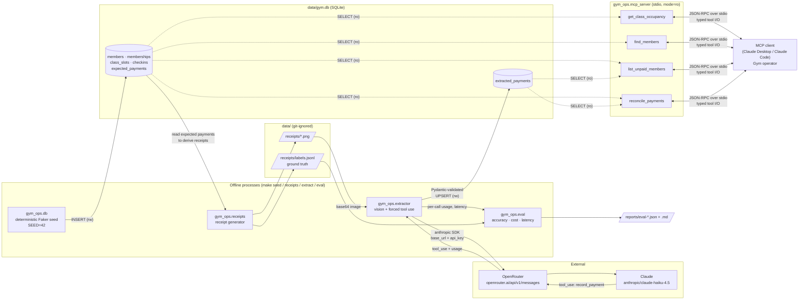
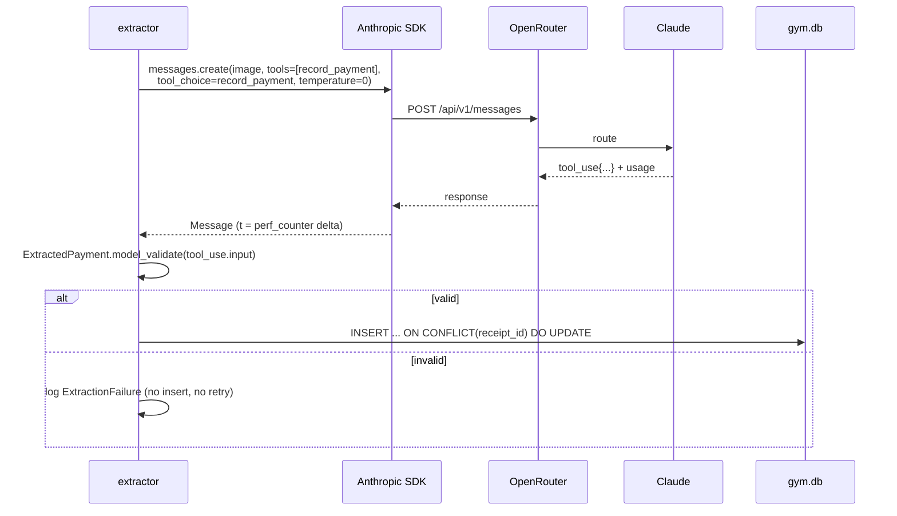
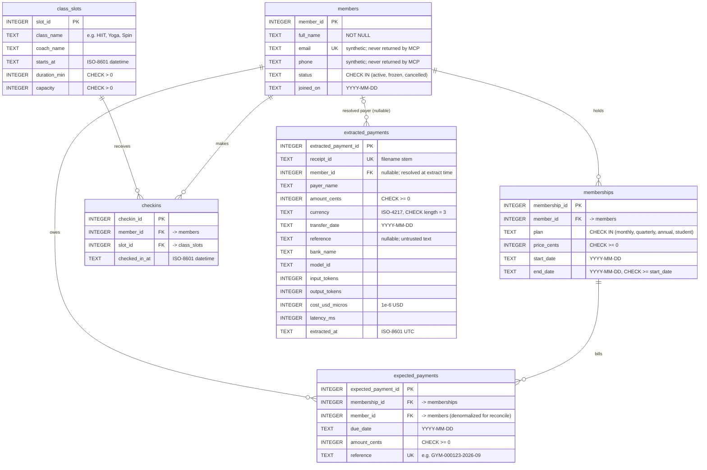

# Architecture

See [SPEC.md](SPEC.md) for requirements and [adr/](adr/) for decisions. All data is synthetic.

## 1. Data flow

**Trust boundaries**

- *Receipt images are untrusted.* Their text passes through Claude into `extracted_payments` as data (FR-9) and later reaches the MCP client's model via `reconcile_payments`. This is why the MCP surface is four fixed, read-only, PII-minimal tools (ADR-0004).
- *OpenRouter is an external processor.* Only synthetic receipt images leave the machine. The API key lives in `.env` → `Settings.OPENROUTER_API_KEY: SecretStr` and is passed explicitly to the client (ADR-0001).
- *The MCP server is read-only at the engine level* (`mode=ro` + `query_only`, ADR-0003). Only the seeder and extractor hold read-write connections.

**Extraction sequence (one receipt)**

## 2. Data model

Conventions: money is `INTEGER` cents (`CHECK (typeof(col) = 'integer' AND col >= 0)`); dates are ISO-8601 `TEXT` (`YYYY-MM-DD`, `CHECK (date(col) = col)`); timestamps are ISO-8601 UTC `TEXT` (`YYYY-MM-DDTHH:MM:SSZ`); every FK is declared and `PRAGMA foreign_keys=ON` on read-write connections.

Additional constraints not expressible in Mermaid:

- `checkins`: `UNIQUE (member_id, slot_id)` — a member checks in to a slot at most once.
- `expected_payments`: `UNIQUE (membership_id, due_date)`.
- `extracted_payments.member_id` is resolved by the extractor (reference lookup, then normalized-name lookup) and may be `NULL` for unidentifiable payers — these surface as unidentified transfers (reason `unknown_payer`) in reconciliation. Links between transfers and bills are **not stored**: `reconcile_payments` computes them at query time (SPEC FR-14, ADR-0005), which keeps the MCP server read-only.

### Indexes

Each index is justified by a `WHERE` / `JOIN` / `GROUP BY` in a specific tool (verified by `EXPLAIN QUERY PLAN`, SPEC FR-3).

| Index | Columns | Used by |
| --- | --- | --- |
| `idx_members_status` | `members(status)` | `find_members` filter |
| `idx_memberships_member` | `memberships(member_id, end_date)` | `find_members` current-plan join |
| `idx_class_slots_starts_at` | `class_slots(starts_at)` | `get_class_occupancy` date range |
| `idx_class_slots_name_starts` | `class_slots(class_name, starts_at)` | `get_class_occupancy` class filter + `GROUP BY class_name` |
| `idx_checkins_slot` | `checkins(slot_id)` | occupancy `JOIN` / `COUNT` per slot |
| `idx_expected_due` | `expected_payments(due_date)` | `list_unpaid_members`, `reconcile_payments` window |
| `idx_expected_member_due` | `expected_payments(member_id, due_date)` | reconcile fallback match |
| `idx_extracted_date` | `extracted_payments(transfer_date)` | reconcile window |
| `idx_extracted_reference` | `extracted_payments(reference)` | reconcile primary match |
| `idx_extracted_member_date` | `extracted_payments(member_id, transfer_date)` | reconcile fallback match |

`UNIQUE` constraints are indexed implicitly: `members.email`, `expected_payments.reference`, `extracted_payments.receipt_id`, plus `checkins(member_id, slot_id)` and `expected_payments(membership_id, due_date)`, whose leading columns already serve the `checkins.member_id` and `expected_payments.membership_id` FK lookups — so no separate indexes are created for those.

## 3. Module map

| Module | Responsibility | DB access |
| --- | --- | --- |
| `gym_ops.config` | `Settings` (pydantic-settings, `.env`), prices, seed | — |
| `gym_ops.db` | DDL, connection factories (`connect_rw`, `connect_ro`), seeder | rw (seed) |
| `gym_ops.receipts` | Render PNG receipts from expected payments + injected noise/edge cases; write `labels.jsonl` | ro |
| `gym_ops.extractor` | Anthropic client via OpenRouter, forced tool use, validation, upsert | rw (`extracted_payments` only) |
| `gym_ops.mcp_server` | FastMCP stdio server, 4 tools, Pydantic I/O | **ro only** |
| `gym_ops.eval` | Run extractor over labels, metrics, gates, reports | ro + extractor |

## 4. Scale & reliability notes

Current envelope: ~300 members, ~500 slots, ~10k check-ins, ≤ 500 receipts/month — every tool query is index-backed and sub-100 ms (NFR-8).

- **Extractor failures:** SDK `max_retries=2` with backoff for 429/5xx; 30 s timeout; per-receipt failure isolation (one bad receipt never aborts the run); upsert makes re-runs idempotent.
- **Cost control:** fixed `max_tokens=512`; eval prints projected spend before running (N × mean historical cost).
- **Beyond this envelope:** Message Batches API direct to Anthropic for bulk extraction; PostgreSQL with a read-only role and per-gym RLS; HTTP MCP transport with authz (see "Revisit at scale" in each ADR).
